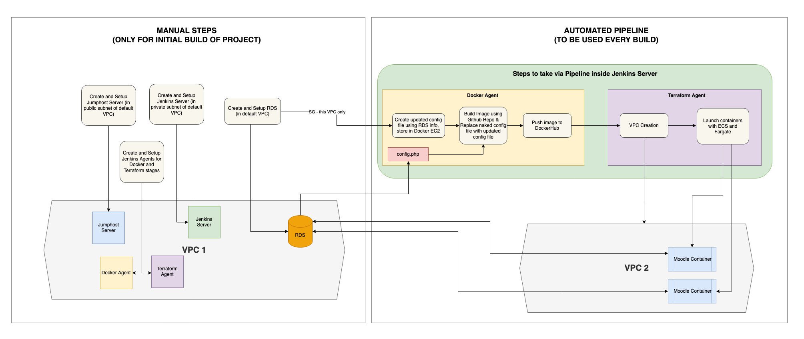

# Kuriosity

| __Team Member__  | __Function/Role__ |
| -----------      | -----------       |
| Mallah-Divine Mallah | Program Manager   |
| Caden Hong       | Chief Architect   |
| Randall Da Costa | Admin             |
| Anjuli Panizzi   | Analyst |
| Chanesh Mahadeo  | Analyst |
| Brian Louie      | Analyst |

## Application
- [Moodle](https://moodle.org) is a learning platform designed to provide
educators, administrators and learners with a single robust, secure and
integrated system to create personalised learning environments

   
## Infrastructure toolkit 

>Cloud Platform & Provider  \

>Application containerization  \
 

 >CI/CD pipeline management \
 

>Version control system \
 

>Web server \
 

>Programming languages \
    

 >Infrastructure-as-Code (IaS) \

 
    
## High-Level system design

 
