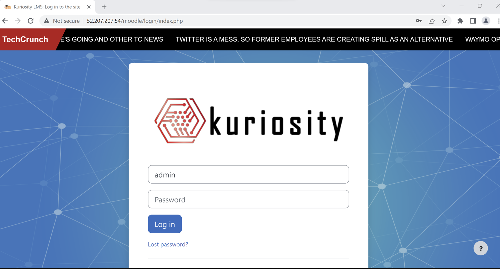
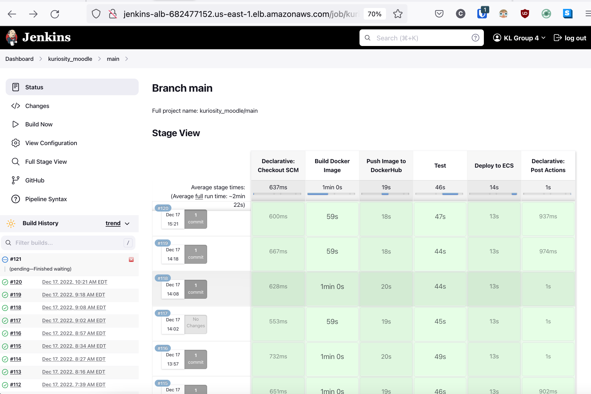

# Final Project: Complete Deployment of an Application
Build an architecture to deploy an application of your choice. Develop a team structure, follow a project timeline, adhere to a budget of $200, and implement all technologies required by this project brief. Demonstrate your understanding of the CI/CD pipeline, infrastructure-as-code, monitoring and alerting systems, systems design and documentation. Build a system that demonstrates your understanding of scalability, security, and resilience.

## Objectives
- Demonstrate mastery of the CI/CD pipeline
- Deploy an application to a production environment
- Utilize and diagram infrastructure as code
- Demonstrate effective project management
- Communicate learning via presentation and demonstration

-----------------------------------------------------------------------------------------------------------------------------
# Kuriosity

### What's a Moodle?
[Moodle](https://moodle.org) is a learning platform designed to provide educators, administrators and learners with a single robust, secure and integrated system to create personalised learning environments

### What is Kuriosity?
- Kuriosity is our vision for a version 3.0 of the Kura Labs LMS
- An improved platform to facilitate smoother navigation and enhance the student experience

## Team
| __Team Member__  | __Function/Role__ |
| -----------      | -----------       |
| [Mallah-Divine M.](https://github.com/mallahdiv) | Program Manager   |
| [Caden H.](https://github.com/cadenhong)       | Chief Architect   |
| [Randall D.C.](https://github.com/dacostaration) | Admin             |
| [Anjuli P.](https://github.com/AnjKura)   | Analyst |
| [Chanesh M.](https://github.com/Chaneshm)  | Analyst |
| [Brian L.](https://github.com/kura3git)      | Analyst |

## Website
 

## Load Testing with K6

## Jenkins Pipeline

## Systems Design
 

## Infrastructure Toolkit 

>Cloud Platform & Provider  \

 

>Containerization  \
 

 >CI/CD Pipeline Management \
 

>Version Control System \
 

>Web Server \
 
 

>Application Stack \
    

 >Infrastructure-as-Code (IaS) \

